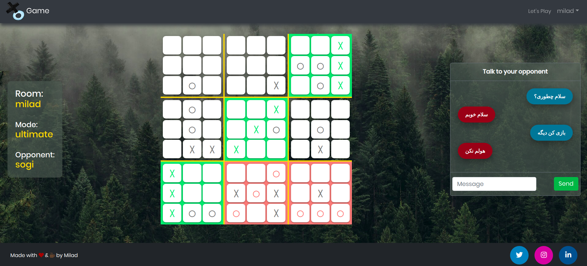

# Multiplayer XO Game Back-End

A real-time two player XO game with chat functionality

Front-end repository:
https://github.com/Miladdarren/melanthios

## Stacks

- **Node.js**
- **Express**
- **MongoDB**
- **Mongoose** as ODM
- **Socket.io** for real-time communication and chat support
- **Passport.js** for authentication by both JWT and Google OAuth strategy
- **Docker** for containerization
- **Travis-CI** as CI/CD
- **Sendgrid API** as e-mail service
- **Cloudinary API** as cloud service for image upload functionality
- **Heroku** as host

## NPM Commands

| Command     | Description                                                                |
| ----------- | -------------------------------------------------------------------------- |
| npm install | Install dependencies                                                       |
| npm run dev | Start development server @**localhost:8000** with predefined env variables |
| npm start   | Start production server                                                    |

## Some of the API endpoints

| HTTP Method | Url                  | Description                         |
| ----------- | -------------------- | ----------------------------------- |
| GET         | /user/               | Get user information                |
| PATCH       | /user/profile        | Update user profile                 |
| PATCH       | /user/profile/avatar | Update user avatar                  |
| DELETE      | /user/profile/avatar | Delete user avatar                  |
| POST        | /auth/google         | Authenticate user with google token |
| POST        | /auth/confirmation   | Confirm email address               |
| POST        | /auth/resend         | Resend confirmation email           |
| POST        | /auth/forgotpass     | Send password reset email           |
| POST        | /auth/resetpass      | Reset user password                 |
| GET         | /auth/uploadurl      | Generate signature for image upload |
